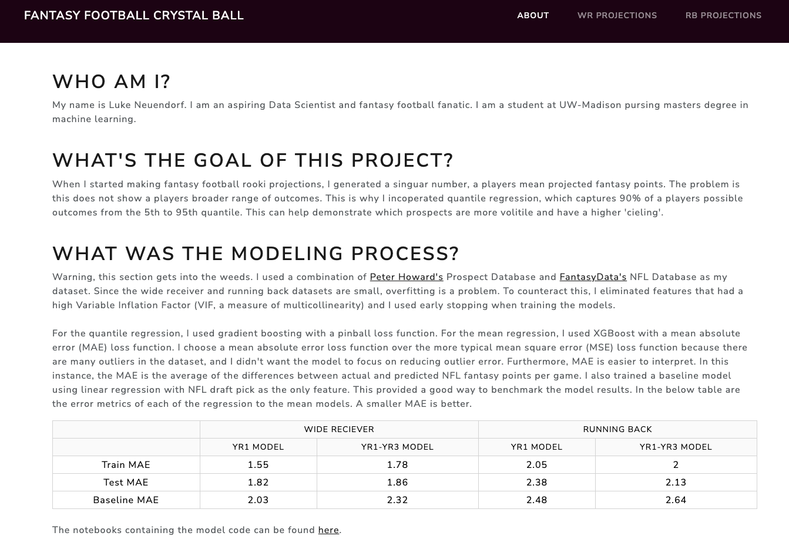
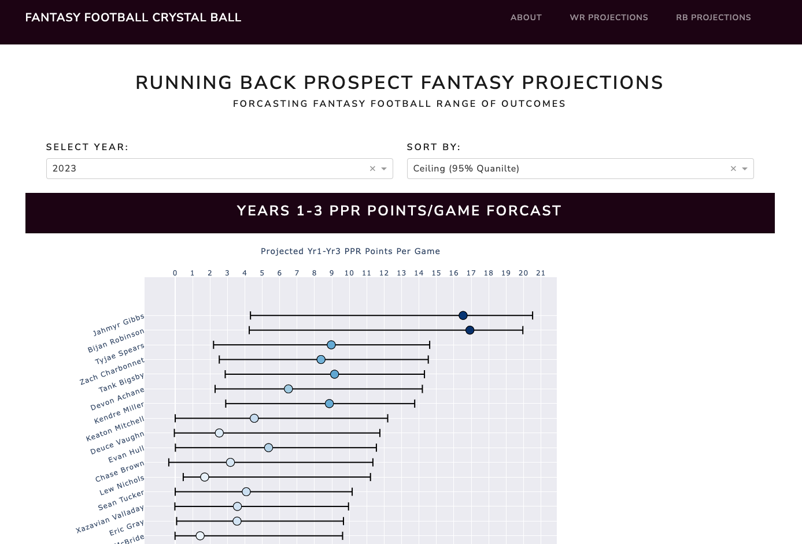
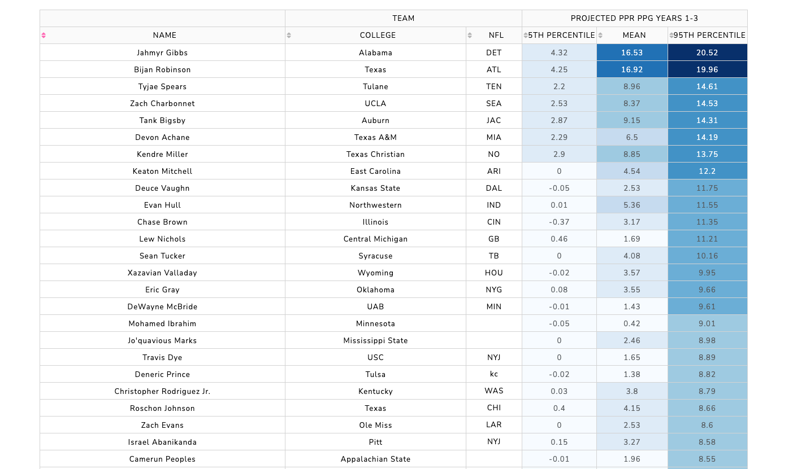
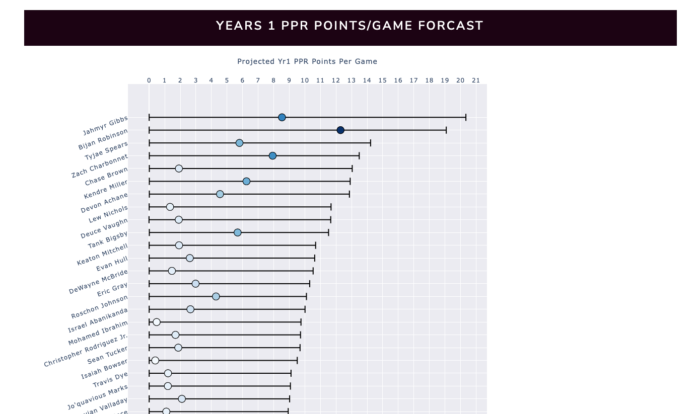
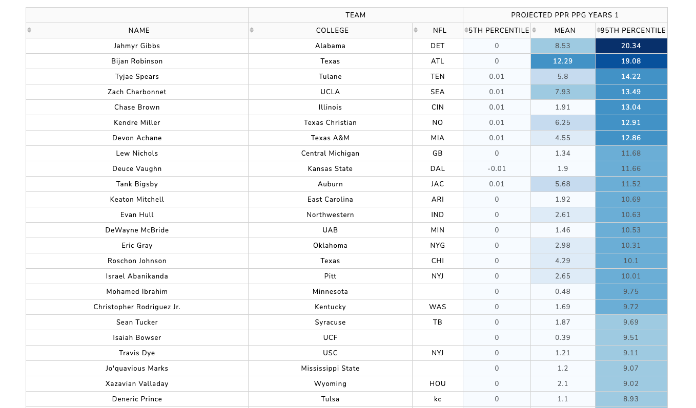

# Fantasy Football Crystal Ball
An application designed to project the performance of rookie NFL running backs (RBs) and wide receivers (WRs) over their first three seasons. Built to assist dynasty fantasy football players in selecting the best rookie skill position players for their drafts.

## Model Code
link: [github.com/lneuendorf/NFL_Prospect_Models](https://github.com/lneuendorf/NFL_Prospect_Models)

## Screenshots of Running Application
The app is not currently hosted, so here are some screenshots of what it looks like. Otherwise, you can clone the repo, create a virtual env, install the requirements.txt, and run the app inside the virtual env with the command `python index.py`.
### i. Home Page

### ii. 2023 Rookie Running Back Projections

### iii. 2023 Rookie Wide Receiver Projections
Unfinished - I never finished updating the WR models. As I originally created the models for the 2022 rookie class.
